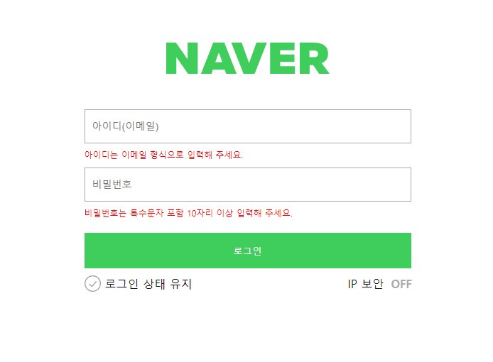
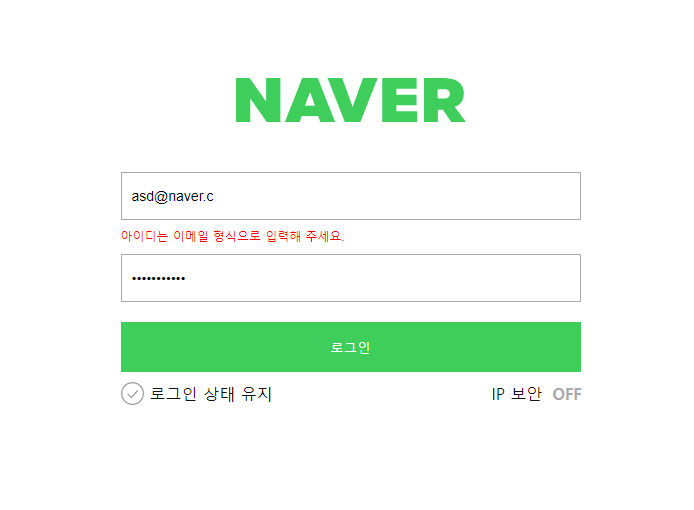
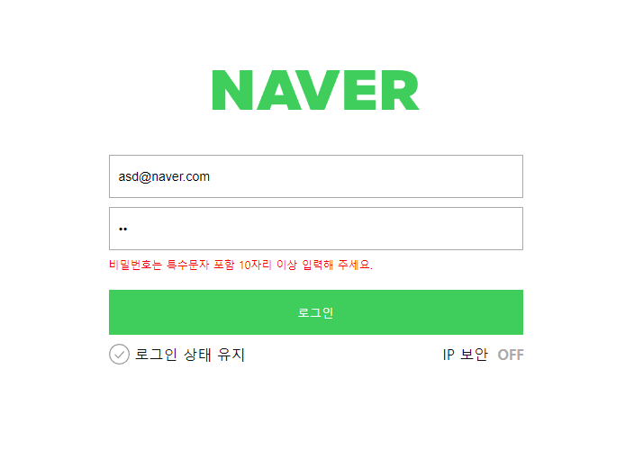
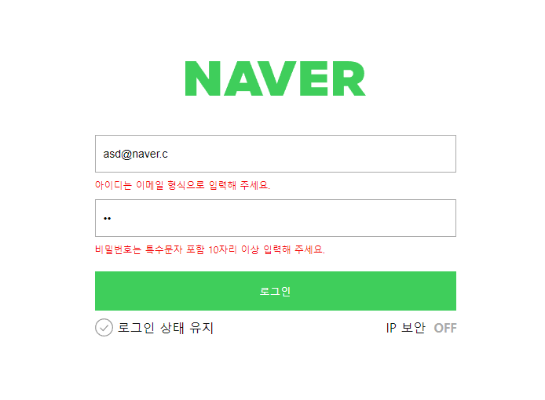
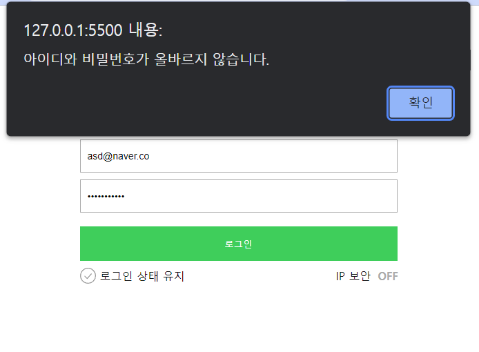

# 자바스크립트 네이버 로그인 과제 (~7/16)
### 1. 완성 이미지
##### - 아이디, 비밀번호 인풋박스가 빈칸일 때
  

##### - 아이디가 맞지 않을 때
  

#####  - 비밀번호가 맞지 않을 때
  

#####  - 아이디, 비밀번호가 맞지 않을 때
  

#####  - 버튼을 눌렀을 때 아이디, 비밀번호가 일치하지 않을 때
  

#####  - 아이디, 비밀번호가 맞아서 Welcome Page로 이동
  


<br />

### 2. Javascript
---
- 사용자가 설정한 아이디, 비밀번호 정보 const user 변수로 설정
```js
const user = {
  id: "asd@naver.com",
  pw: "spdlqj123!@",
};
```
- 사용자가 이메일, 비밀번호를 잘 입력했는지 확인하는 정규식
```js
//사용자가 이메일을 잘 입력했는지 확인하는 정규식?
function emailReg(text) {
  const re =
    /^(([^<>()\[\]\\.,;:\s@"]+(\.[^<>()\[\]\\.,;:\s@"]+)*)|(".+"))@((\[[0-9]{1,3}\.[0-9]{1,3}\.[0-9]{1,3}\.[0-9]{1,3}\])|(([a-zA-Z\-0-9]+\.)+[a-zA-Z]{2,}))$/;

  return re.test(String(text).toLowerCase());
}
//사용자가 비밀번호을 잘 입력했는지 확인하는 정규식?
function pwReg(text) {
  const re = /^(?=.*[a-zA-Z])(?=.*[0-9])(?=.*[!@#$%^*+=-]).{6,16}$/;
  return re.test(String(text).toLowerCase());
}
```
- querySelector로 선택자 불러오기
```js
//! 선택자 불러오기
const userEmail = document.querySelector("#userEmail");
const userPassword = document.querySelector("#userPassword");
const btnLogin = document.querySelector(".btn-login");
```
- 이메일, 비밀번호 인풋 이벤트리스너 부분
- 사용자가 인풋에 지정한 정규식형식에 맞게 썻는지 확인하는 함수 
```js

//! 사용자가 이메일, 비밀번호 인풋을 형식에 맞게 썻는지 확인하는 함수
//! 이메일 인풋 이벤트 함수
function handlerEmailInput() {
  if (emailReg(userEmail.value) === true || userEmail.value === "") {
    userEmail.classList.remove("is--invalid");
  } else {
    userEmail.classList.add("is--invalid");
  }
}
//! 비밀번호 인풋 이벤트 함수
function handlerPasswordInput() {
  if (pwReg(userPassword.value) === true || userPassword.value === "") {
    userPassword.classList.remove("is--invalid");
  } else {
    userPassword.classList.add("is--invalid");
  }
}
```

- 클릭 이벤트 함수 function clickHandler 
  - 아이디 비밀번호가 일치하면 welcome 페이지로 이동하는 if문
  - 일치 하지않으면 alert
```js
//! 클릭 이벤트 함수
function clickHandler(event) {
  event.preventDefault(); //찾아보기

  //! 아이디 비밀번호가 일치하면 welcome 페이지로 이동
  if (userEmail.value === user.id && userPassword.value === user.pw) {
    window.location.href = "welcome.html";
  } else if (
    !(userEmail.value === user.id) &&
    !(userPassword.value === user.pw)
  ) {
    alert("아이디와 비밀번호가 올바르지 않습니다.");
  } else if (!(userEmail.value === user.id)) {
    alert("아이디가 올바르지 않습니다.");
  } else if (!(userPassword.value === user.pwuser)) {
    alert("비밀번호가 올바르지 않습니다.");
  }
}
```
- 이벤트 addEventListener
```js
//! addEventListener input, click
userEmail.addEventListener("input", handlerEmailInput);
userPassword.addEventListener("input", handlerPasswordInput);
btnLogin.addEventListener("click", handlerClick);
```


<br />

### 3. 어려웠던 점
---


- addEventListener에 대한 학습이 더욱 필요한거 같다.
```js
userEmail.addEventListener("input", function ()
```


